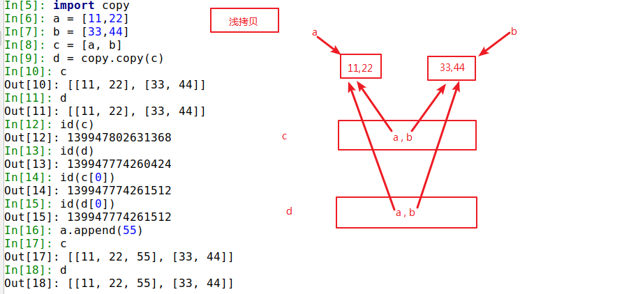
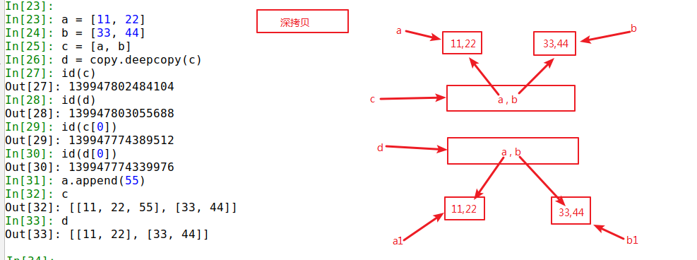

## GIL锁

### 简介
Python在使用CPython作为解释器,实现多进程时会受到全局解释器锁的影响,
无论服务器有几个CPU,所有的线程占用资源加起来只能跑满一个CPU。

GIL并不是Python的特性，它是在实现Python解析器(CPython)时所引入的一个概念。

### 实现真正的多线程
1. 选择其他的Python解释器，如JPython
2. 使用其它编程语言实现方法，[然后通过Python调用](https://blog.csdn.net/weixin_40449300/article/details/82194558)

### QA
q：什么时候会释放Gil锁？

1. 遇到像 i/o操作这种 会有时间空闲情况 造成cpu闲置的情况会释放Gil
2. 会有一个专门ticks进行计数 一旦ticks数值达到100 这个时候释放Gil锁 线程之间开始竞争Gil锁(说明:
    ticks这个数值可以进行设置来延长或者缩减获得Gil锁的线程使用cpu的时间)

q： 互斥锁和Gil锁的关系？ [详情](https://blog.csdn.net/weixin_41594007/article/details/79485847)

- Gil锁  : 保证同一时刻只有一个线程能使用到cpu
- 互斥锁 : 多线程时,保证修改共享数据时有序的修改,不会产生数据修改混乱

## 浅拷贝和深拷贝
import copy

### 浅拷贝  copy.copy()

如上图所示，浅拷贝只会拷贝最顶层的对象，
对列表中的复杂对象，只是将引用地址指向原数组中的对象

### 深拷贝  copy.deepcopy()

如上图所示，深拷贝会将所有对象全部拷贝一份

> ps:拷贝元组时，若元组内的对象全部都是不可变对象，则浅拷贝和深拷贝
不会执行，只是将引用传递。若元组内包含可变对象，浅拷贝会传递引用，
而深拷贝则与列表深拷贝时一致，将元组内所有对象全部拷贝一份

## 私有化
- xx：公有变量
- _xx：但前置下划线，私有化属性或方法，无法通过from some_module import *导入，
类对象和子类可以访问
- __xx：双前置下划线，避免与子类中的属性命名冲突，无法在外部直接访问(名字重整)
- __xx__：双前后下划线，用户名字空间的魔法对象或属性(少用)
- xx_：单后置下划线，用于避免与Python关键词冲突(最好不用)

名字重整(name mangling)：防止子类意外重写基类方法或者属性，可以通过_Class__object
机制访问private属性

